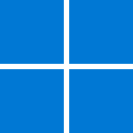
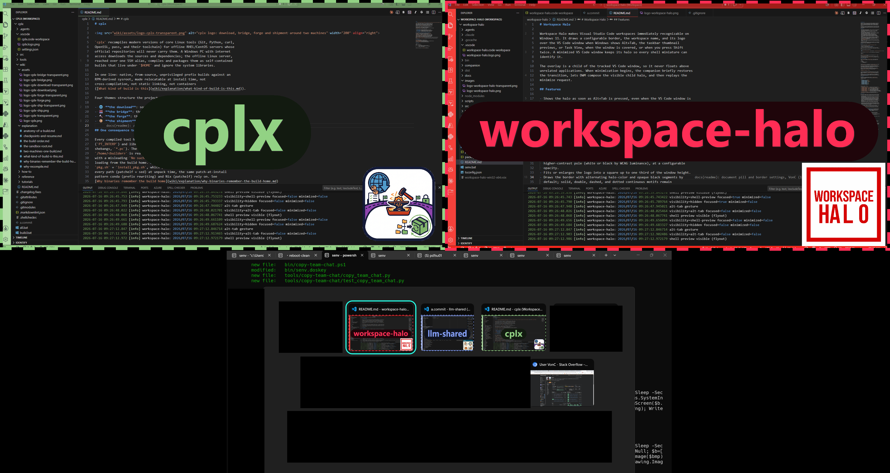

# Workspace Halo



Workspace Halo identifies each Visual Studio Code window on **Windows 11**
with a halo: a colored border, the workspace name, and its logo, drawn over
the window exactly when you need to tell your workspaces apart, and hidden
while you work. It is a Windows-only extension: the overlay is drawn by a
Win32 native host.



## Install from the Marketplace

Workspace Halo is published on the
[Visual Studio Marketplace](https://marketplace.visualstudio.com/items?itemName=vonc.workspace-halo):
search "Workspace Halo" in the Extensions view, or run
`code --install-extension vonc.workspace-halo`. Only Windows x64 VS Code
sees the listing, which matches what the extension supports.

Building locally stays available for development or audit. With Node.js 22
or later and Go already on `PATH`, `build.bat` works directly: no need to
install senv first. Without them, the portable
[senv](https://github.com/VonC/setupsenv) toolchain provides both:
`dwl node 22`, `inst node 22`, then the project `senv.bat`. The details are
in the wiki: [set up the build toolchain](wiki/how-to/set-up-the-build-toolchain.md)
and [build and package the VSIX](wiki/how-to/build-and-package-the-vsix.md).

## Two files give a workspace its halo

Once the extension is installed (from the Marketplace, or a locally built
`workspace-halo-win32-x64.vsix` via **Install from VSIX...**), in a folder
named `my-project`:

1. Save the workspace as `.vscode\my-project.code-workspace`
   (**File > Save Workspace As...**): the workspace is now named after its
   folder.
2. Add its logo as `.vscode\my-project.logo.png`, named after the workspace.

```text
my-project/
`-- .vscode/
    |-- my-project.code-workspace
    `-- my-project.logo.png
```

When both files exist (names match exactly, case included), the halo is
active for that window. Nothing else is required; without them the extension
stays completely inert.

## When the halo appears

The active halo shows itself only at identification moments:

- when the window opens, until you click in the focused window;
- during Alt+Tab, while Alt is held;
- while the mouse rests on a Windows taskbar, where thumbnails preview;
- on a double-Shift (two Shift taps within 400 ms), until the next input;
- while the window is minimized, so its thumbnails keep the identity;
- while another window partially covers it, unless it is focused.

A focused window shows no halo outside these triggers.

## One color with Peacock

Workspace Halo pairs with the
[Peacock](https://marketplace.visualstudio.com/items?itemName=johnpapa.vscode-peacock)
extension: when the workspace has a Peacock color (a `#rrggbb` value of
`peacock.color` saved for that workspace), the halo border and name take that
exact color, so one hue identifies the workspace inside and around the
window. Otherwise `workspaceHalo.color` applies.

## Everything else is in the wiki

Configuration and styling, differently named root folders, troubleshooting,
building, publishing and signing, and the inner workings are documented in the
[wiki](wiki/README.md), organized on the [Diátaxis](https://diataxis.fr/)
model: [explanation](wiki/README.md#-explanation),
[tutorials](wiki/README.md#-tutorials),
[how-to guides](wiki/README.md#-how-to-guides), then
[reference](wiki/README.md#-reference).

Workspace Halo supports stable desktop VS Code on Windows 11. It is a UI
extension, not intended for web VS Code, vscode.dev, or remote UIs on another
operating system. License: [MIT](LICENSE).
